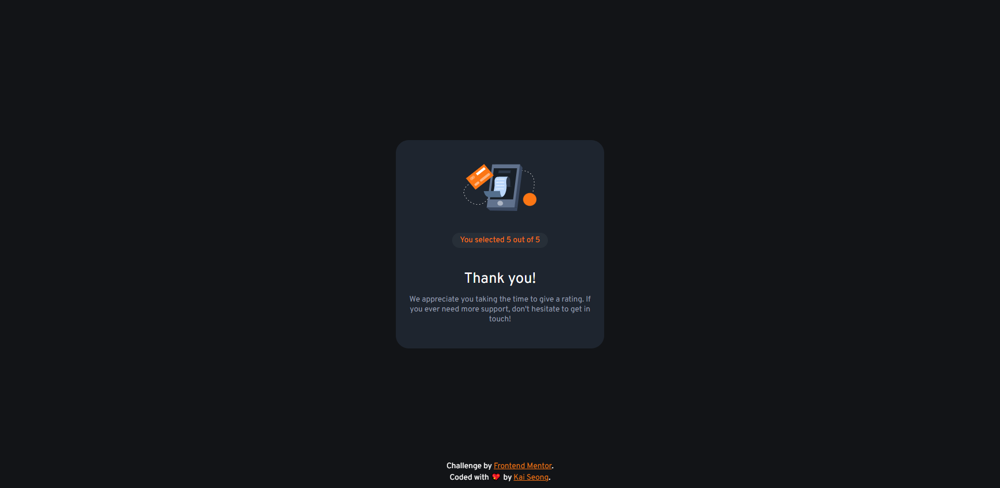

# 💯 Interactive Rating Component

This is a solution to the [Interactive Rating Component challenge on Frontend Mentor](https://www.frontendmentor.io/challenges/interactive-rating-component-koxpeBUmI).

## ❓ The challenge

Users should be able to:

- View the optimal layout for the app depending on their device's screen size
- See hover states for all interactive elements on the page
- Select and submit a number rating
- See the "Thank you" card state after submitting a rating

## 📸 Screenshots

 

## 🔗 Links

- [Solution URL](https://www.frontendmentor.io/solutions/interactive-rating-component-using-css-flexbox-S1n-EXESq)
- [Live Site URL](https://ks-interactive-rating-component.netlify.app/)

## 😓 What I Struggled With

1. Positioning of elements (CSS Units/Margin/Padding/Inheritance)
2. DOM Manipulation (Read JS Documentation!)
3. HTML Dataset (Read HTML Documentation!)
